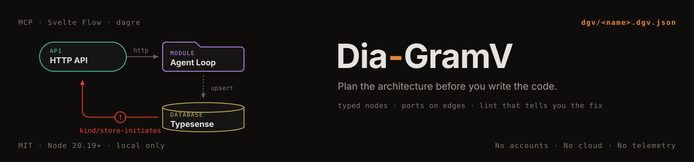

<div align="center">
  

  <p><strong>Plan a system's architecture as a typed, linted, live diagram — before you write the code.</strong></p>

  <p>
    
    
    
    
    
  </p>

  <p>Your diagrams are files in your repo. No accounts, no server, no telemetry.</p>

  <p><a href="#setup"><strong>Setup ↓</strong></a> · <a href="#mcp-tools"><strong>MCP tools</strong></a> · <a href="examples/local-ai-harness.dgv.json"><strong>Example diagram</strong></a></p>
</div>

---

Modules, APIs, programs, databases, queues, bridges, sidecars, devices — each is a node with a shape and a kind; each connection carries a protocol and binds to a **port** the target declares. A lint pass tells you, with a stable code and a concrete fix, when the plan cannot work: an edge into an undeclared port, a protocol mismatch, a store that initiates calls, a one-sided bridge, an import cycle, an API nobody calls. All of that surfaces *before* a day of tokens goes into the wrong plan.

Local only, file-based, no accounts: diagrams are `dgv/<name>.dgv.json` in your project.

```
Claude Code  ──MCP (stdio)──▶  dgv mcp  ──▶  dgv/*.dgv.json  ◀──  dgv serve ──▶ browser viewer (Svelte Flow)
                                                    ▲                              │
                                                    └──────── save / drag / edit ──┘
```

Inspired by [archify](https://github.com/tt-a1i/archify) (typed IR + repairable diagnostics) and by the arch-viewer draft in Cerveau (Svelte Flow, nested frames). DGV differs on purpose: a live editable canvas instead of static SVG, explicit frame membership instead of geometry inference, dagre layout, and ports/contracts on edges.

## Packages

| path | what |
|---|---|
| `packages/core` | isomorphic ESM: catalog, validator, lint, dagre layout, exports, file store |
| `packages/mcp` | `dgv` CLI + MCP server (tools below) + local HTTP/SSE server for the viewer |
| `packages/viewer` | Svelte 5 + Svelte Flow editor: shaped nodes, frames, folding, inspector, live problems |
| `skill/` | Claude Code skill (`SKILL.md`) that teaches the planning workflow |
| `examples/` | `local-ai-harness.dgv.json` |

## Setup

```bash
cd Dia-GramV
npm install
npm run build                         # builds the viewer once
node packages/mcp/bin/dgv.mjs doctor  # checks node, viewer, prints the mcp add line

# register the MCP server for Claude Code (user scope, any project)
claude mcp add dgv -s user -- node /ABS/PATH/Dia-GramV/packages/mcp/bin/dgv.mjs mcp
# install the skill
ln -s /ABS/PATH/Dia-GramV/skill ~/.claude/skills/dgv
```

Diagrams go to `./dgv` under the directory Claude Code was started in (override with `DGV_DIR`).

## MCP tools

| tool | does |
|---|---|
| `dgv_catalog` | node kinds (shape + meaning), edge kinds, protocols, statuses |
| `dgv_list`, `dgv_read` | find and read diagrams (summary outline or full JSON) |
| `dgv_create` | new empty diagram |
| `dgv_apply` | upsert frames/nodes/edges by id, remove by id; auto-places new nodes; returns the lint report |
| `dgv_lint` | diagnostics with `code`, `severity`, `subject`, `fixes` |
| `dgv_layout` | dagre layout, members stay inside their frame |
| `dgv_open` | start the viewer if needed, open the diagram in the browser |
| `dgv_export` | markdown tables (for docs/CLAUDE.md), mermaid, outline, or a standalone SVG |

## Viewer

`node packages/mcp/bin/dgv.mjs serve` → http://127.0.0.1:7710

- add nodes by kind, drag from a node's right handle to connect, drag nodes into frames (frames grow to fit), resize frames
- inspector edits every field incl. ports; problems panel lints live and jumps to the subject
- colour by kind or by build status; `Ctrl+S` saves; the page reloads when the agent changes the file (or warns if you have unsaved edits)
- **fold a frame into one node** — hover a frame and fold it, or press `S` for the simple view. A folded frame draws as one card showing what it holds, and the wires crossing into it merge into one labelled `N links`. The folded view keeps its own layout, per diagram, in your browser — never in the file
- **snapshot** (`Shift+S`) saves what is on screen as a standalone SVG for a README or docs page: routed wires and all, cropped to the content, no external fonts or images, nothing fetched
- `npm run dev` runs Vite on 5190 with `/api` proxied to 7710 for hacking on the viewer

Frames do not nest. Folding one had to answer "and what about the frames inside it", and every answer was a special case; one flat level makes a frame exactly one card. `frame/nested` is a lint error.

## CLI

```bash
dgv lint <name|file> [--json]   dgv layout <name|file> [--direction TB|LR]
dgv export <name|file> [--format markdown|mermaid|summary|svg]
dgv list | catalog | doctor | serve [--dir d --port p --no-open] | open <name> | mcp
```

## File format

See [`skill/references/format.md`](skill/references/format.md) for the schema, kinds, and every lint code.

## Tests

```bash
npm test      # core: schema, lint rules, patch semantics, layout containment, exports, store
```

## Not in scope (yet)

Collaboration / hosting, sequence & lifecycle diagram types, repository auto-discovery. The file format is versioned (`dgv: 1`) so those can come without breaking existing diagrams.

MIT.
