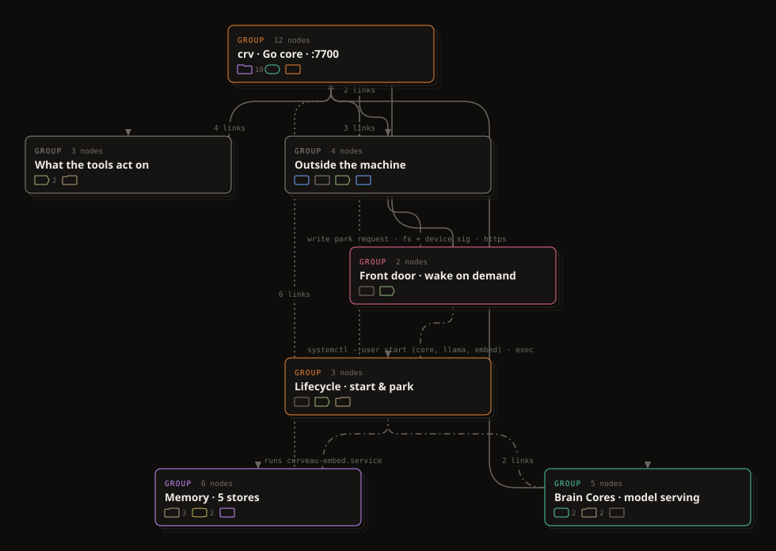

<div align="center">
  

  <p><strong>An MCP server that gives your coding agent a typed, linted model of the system you are building — and a browser canvas for you.</strong></p>

  <p>
    
    
    
    
    
  </p>

  <p>Diagrams are JSON files in your repo. Runs on your machine — no accounts, no cloud, no telemetry.</p>

  <p>
    <a href="#install"><strong>Install ↓</strong></a> ·
    <a href="#a-session-start-to-finish"><strong>A session</strong></a> ·
    <a href="#mcp-tools"><strong>MCP tools</strong></a> ·
    <a href="#what-the-linter-checks"><strong>Lint</strong></a> ·
    <a href="#is-it-still-true"><strong>Drift</strong></a> ·
    <a href="#the-file-format"><strong>Format</strong></a>
  </p>
</div>

---

## What it is

One file, two ways in.

The file is `dgv/<name>.dgv.json`: frames (boundaries), nodes (components) and edges (connections), each with a **kind** from a fixed catalog. A node can declare **ports**; an edge can name the port it lands on and the **protocol** it speaks. It is a plain JSON document that lives in your repository next to the code it describes.

The **MCP server** is how an agent works with that file. Through it the agent creates a diagram, changes it, reads it back as a short outline, and — on every write — gets a lint report back: a stable code, the element concerned, and concrete fixes. Give nodes a `path` and it can also answer whether the diagram still matches the code on disk.

The **viewer** is how you work with it. A Svelte Flow canvas where kinds have shapes, wires carry their protocol, an inspector edits every field, and the problems panel shows the same lint live. When the agent changes the file, the page reloads.

<div align="center">
  
</div>

## Where it came from

[Cerveau](https://github.com/ShAInyXYZ/Cerveau) is a local-first agentic coding harness, and an older project. Its docs folder held a private, unshipped draft called `arch-viewer`: a Svelte Flow canvas reading a `Diagram.json` of its architecture — 99 nodes, 127 edges. Nodes had a kind; edges were a label. Nothing but a browser could read it, so the agent doing the building never saw it, and the hierarchy-aware layout it needed was fragile enough that a frame could swallow its neighbours.

DGV keeps the parts that worked — the canvas, the frames, the dagre layout — and puts a contract underneath:

| `arch-viewer` draft | DGV |
|---|---|
| a JSON only the viewer read, in a private folder | a JSON the agent reads and writes through MCP, in the repo |
| nodes had a kind; edges were a label | a catalog of node kinds, edge kinds, protocols, statuses; ports on nodes |
| membership implied by where a box sat | membership declared: `node.frame` |
| drew whatever it was given | lints every write, and says how to fix it |

## Why it matters when an AI is writing the code

The drawing is the least important part. What matters is that the model of the system is a file a program can read, check and change.

**If you vibecode**, the system grows faster than you can keep it in your head, and the shape you *think* it has drifts from the shape it has. DGV gives that shape a place to live, and a linter that objects when it stops making sense.

**If you develop with an AI beside you**, the diagram is where you state intent the code cannot express yet — *the worker consumes the queue; the API never writes to the bucket directly* — once, in a form every later session inherits.

**If you are the agent**, this is the difference between grepping and knowing. In an unfamiliar repository you rebuild the picture by opening files. `dgv_read` hands you the picture. This is its complete output for the example below, verbatim:

```
# Notes app
A small web app with background jobs — the kind of thing you'd vibecode in an afternoon.
frames 3 · nodes 6 · edges 5 · updated 2026-08-27

## frame browser: Browser
- web [ui] Notes UI — SvelteKit
## frame server: Server · one process
- api [api] HTTP API — /api/notes ports: rest:http/in
- jobs [worker] Job runner — thumbnails, exports
## frame data: Data
- pg [db] Postgres — notes, users ports: sql:sql/in
- redis [queue] Job queue — Redis lists ports: jobs:redis/in
- s3 [storage] Object store — uploads ports: put:s3/in

## edges
- web-api: web → api [sync http] fetch ports ·→rest
- api-pg: api → pg [data sql] ports ·→sql
- api-redis: api → redis [async redis] enqueue ports ·→jobs
- jobs-redis: jobs → redis [async redis] consume ports ·→jobs
- jobs-s3: jobs → s3 [data s3] ports ·→put
```

An agent that can read `api → pg [data sql] ·→sql` does not invent a REST endpoint on the database.

**It also carries progress.** A node can have a `status` — `todo`, `wip`, `done`, `blocked`, `failed`, `update`. Press `2` in the viewer to colour by status instead of kind, and the same file is the build board. An agent can read what is still `todo` and continue where the last session stopped.

## A session, start to finish

Built through the MCP for this README. Requests are shortened with `…`; responses are the tool's own output, cut to the fields that matter.

### 1. The agent describes the system

```jsonc
dgv_apply({ name: "notes-app",
  frames: [ { id: "browser", label: "Browser" }, { id: "server", label: "Server · one process" }, … ],
  nodes:  [ { id: "api", kind: "api", label: "HTTP API", frame: "server",
              ports: [ { id: "rest", protocol: "http", dir: "in" } ] }, … ],
  edges:  [ { id: "jobs-s3", source: "jobs", target: "s3", kind: "data", protocol: "s3", targetPort: "upload" },
            { id: "pg-api",  source: "pg",   target: "api", kind: "sync", protocol: "http", label: "notify on change" }, … ] })
```

### 2. The write is rejected, with the reason and the fix

```jsonc
{ "ok": false,
  "lint": { "ok": false, "error": 1, "warning": 2, "info": 0, "total": 3 },
  "diagnostics": [
    { "code": "port/undeclared", "severity": "error",
      "message": "edge \"jobs-s3\" uses target port \"upload\" but node \"s3\" does not declare it",
      "subject": { "type": "edge", "id": "jobs-s3", "field": "targetPort" },
      "fixes": [ "add port {id:\"upload\"} to node \"s3\"", "point the edge at one of: put" ] },
    { "code": "kind/store-initiates", "severity": "warning",
      "message": "\"pg\" is a db; stores do not initiate sync calls to \"api\"",
      "subject": { "type": "edge", "id": "pg-api" },
      "fixes": [ "reverse the edge and mark it kind:\"data\"",
                 "if it is a trigger/CDC stream, add a worker or queue between them" ] },
    … ] }
```

The same three, as the viewer shows them — the failing wire turns red on the canvas, and each entry jumps to its element:

<div align="center">
  
</div>

Two ordinary mistakes: the port is called `put` on the store and `upload` on the edge, and a database is calling back into the API. The first is a typo that would have become a bug. The second is an architecture an agent would have implemented without a second thought. Both come back as an id, a code and a fix — in the same turn — so the plan is repaired before any code exists.

### 3. Repaired, laid out, opened

```jsonc
dgv_apply({ name: "notes-app",
            edges: [ { id: "jobs-s3", source: "jobs", target: "s3", kind: "data", protocol: "s3", targetPort: "put" } ],
            remove: { edges: [ "pg-api" ] } })
→ { "ok": true, "lint": { "ok": true, "error": 0, "warning": 0, "info": 0, "total": 0 } }

dgv_layout({ name: "notes-app", direction: "TB" })
→ { "ok": true, "nodes": 6, "frames": 3 }

dgv_open({ name: "notes-app" })
→ { "url": "http://127.0.0.1:7710/#/notes-app", "dir": "…/dgv" }
```

<div align="center">
  
</div>

A `db` is a cylinder and a `queue` a skewed box, so the kind reads before the label does. The inspector on the right edits every field, ports included; the `!` tab lists the live diagnostics and jumps to the element. `Ctrl+S` saves. If the agent changes the file while you have unsaved edits, the page tells you and lets you choose.

### 4. Out again, as a picture

`Shift+S` in the viewer, or `dgv_export` with `format: "svg"`. The result is a self-contained SVG — wires routed as on the canvas, cropped to the content, no external fonts or images. The image below is that file, linked from this README:

<div align="center">
  
</div>

The source is [`examples/notes-app.dgv.json`](examples/notes-app.dgv.json): under 4 kB for the whole system.

### At full size

The same tool on Cerveau itself — 35 components, 7 boundaries, 44 connections:

<div align="center">
  
</div>

Fold the frames (`S` in the viewer) and every boundary becomes one node, with the wires that crossed it merged into a single labelled link. It is the same file — there is no second overview diagram to keep in step with the first:

<div align="center">
  
</div>

## Install

You need **Node 20.19+ or 22.12+** (the viewer is built with Vite 8, which sets that floor). Everything else — Svelte 5, Svelte Flow, dagre, the MCP SDK, TypeScript — is fetched by `npm install` into `node_modules`, about 100 MB. Nothing global, nothing to configure, and no network needed after install.

```bash
git clone https://github.com/ShAInyXYZ/Dia-GramV.git
cd Dia-GramV
npm install
npm run build                          # compiles the viewer (this is the step that needs Svelte)
node packages/mcp/bin/dgv.mjs doctor   # checks Node and the build; prints the mcp add line with your path
```

Register the server with Claude Code. User scope means every project can use it:

```bash
claude mcp add dgv -s user -- node /ABS/PATH/Dia-GramV/packages/mcp/bin/dgv.mjs mcp
```

The skill is optional. It teaches the agent the workflow — catalog first, apply, read the lint, repair, layout, open:

```bash
ln -s /ABS/PATH/Dia-GramV/skill ~/.claude/skills/dgv
```

The hooks are optional too, and worth it on any project you come back to — they put the diagram in front of the agent at the start and check it against the code at the end. `doctor` prints the block with your path filled in; it goes in `~/.claude/settings.json`:

```json
{ "hooks": {
    "SessionStart": [ { "hooks": [ { "type": "command", "command": "node /ABS/PATH/Dia-GramV/hooks/session-start.mjs", "timeout": 10 } ] } ],
    "Stop":         [ { "hooks": [ { "type": "command", "command": "node /ABS/PATH/Dia-GramV/hooks/stop.mjs",          "timeout": 10 } ] } ] } }
```

Then, in any project: *"map this system in DGV before we start."* Diagrams go to `./dgv` under the directory the agent was started in; set `DGV_DIR` to put them elsewhere.

No prebuilt viewer ships in the repo, so what runs is compiled from the source you cloned. If you only want the MCP tools, `npm run build` can be skipped: everything works without it except `dgv_open` and `serve`, which need a viewer to serve.

<details>
<summary>CLI, for use without an agent</summary>

```bash
node packages/mcp/bin/dgv.mjs serve [--dir d] [--port p] [--no-open]     # viewer, default http://127.0.0.1:7710
node packages/mcp/bin/dgv.mjs lint   <name|file> [--json]
node packages/mcp/bin/dgv.mjs layout <name|file> [--direction TB|LR]
node packages/mcp/bin/dgv.mjs export <name|file> [--format markdown|mermaid|summary|svg]
node packages/mcp/bin/dgv.mjs drift  <name|file> [--root dir] [--depth n] [--json]
node packages/mcp/bin/dgv.mjs list | catalog | doctor | open <name>
```
</details>

## MCP tools

| tool | does |
|---|---|
| `dgv_catalog` | the node kinds (shape and meaning), edge kinds, protocols and statuses — read once per session |
| `dgv_list` | the diagrams in the directory, with counts |
| `dgv_read` | one diagram: `mode: "summary"` (the outline above, default) or `mode: "json"` (the full document) |
| `dgv_create` | a new, empty diagram |
| `dgv_apply` | upsert frames, nodes and edges by id; remove by id; places new nodes; **returns the lint report**. Partial: to change one field on an existing element, send its id and that field |
| `dgv_lint` | the diagnostics: `code`, `severity`, `subject`, `fixes` |
| `dgv_drift` | does the diagram still describe the code? every `path` must exist, every directory of code must belong to a node |
| `dgv_layout` | dagre layout, `TB` or `LR`; overwrites positions |
| `dgv_open` | starts the viewer if it is not running and opens the diagram |
| `dgv_export` | `markdown` (tables), `mermaid`, `summary` (the outline), or `svg` |

## What the linter checks

Shape first (`schema/invalid`), then references (`ref/missing-node`, `ref/missing-frame`, `ref/duplicate-id`), then the rules below. Every diagnostic names its subject and carries `fixes`. Errors block `ok`; warnings and info are advice.

**Errors** — the write is refused (`ok: false`) until they are fixed.

| code | fires when |
|---|---|
| `port/undeclared` | an edge names a port the node does not declare |
| `port/protocol-mismatch` | the edge's protocol is not the port's protocol |
| `port/direction` | an edge enters an `out` port, or leaves an `in` port |
| `graph/import-cycle` | modules import each other in a loop |
| `frame/nested` | a frame has a `parent` — frames do not nest, see below |
| `ref/missing-node`, `ref/missing-frame`, `ref/duplicate-id`, `schema/invalid` | the file does not hold together |

**Warnings** — the write goes through; the plan probably has a hole.

| code | fires when |
|---|---|
| `port/unbound` | the target declares ports and the edge names none |
| `contract/unspecified` | an edge between different kinds has neither a protocol nor a label |
| `kind/store-initiates` | a database, cache or bucket is the *source* of a call |
| `kind/import-across-programs` | an import crosses a frame boundary — two processes cannot share one |
| `kind/api-unused` | an API that nothing calls |
| `kind/bridge-one-sided` | a bridge touching fewer than two other nodes |
| `graph/orphan` | a node with no edges |
| `layout/overlap`, `layout/outside-frame` | cards overlap, or sit outside their frame — `dgv_layout` fixes both |

**Info** — worth a look, silent in the counts.

| code | fires when |
|---|---|
| `kind/store-access` | a call into a store is `sync` where `data` reads better |
| `kind/module-loose` | a module makes runtime calls but sits in no frame — which program runs it? |
| `kind/external-inside` | an external component drawn inside your own boundary |
| `graph/shared-store` | one store written directly by more than two nodes |
| `layout/unplaced` | nodes that have no position yet |

Setting `ack: "<reason>"` on an element turns its **warnings** into info with the reason attached — the count stops nagging, the fact stays in the file. Errors cannot be acknowledged.

Frames do not nest. Folding a frame into one node had to answer *what about the frames inside it*, and every answer was a special case. One level keeps the fold, the layout and the file simple; `frame/nested` is an error so an old file with a `parent` says so rather than rendering wrongly.

## Is it still true?

Lint says whether the plan is coherent. It cannot say whether the plan is *true* — whether the code on disk is still the code the diagram describes. That takes one more field.

Give a node a `path`: a file, a directory (which claims everything under it), a glob, or a list. Then `dgv_drift` walks the project (`git ls-files` when there is a repository, so `.gitignore` is respected) and reports three things:

| code | severity | means |
|---|---|---|
| `drift/missing` | error | a node's `path` matches nothing — the code moved, or the node describes something that is not there |
| `drift/unclaimed` | warning | a directory of code that belongs to no node |
| `drift/shared` | warning | two nodes claim the same file |
| `drift/unmapped` | info | a node with no `path` — right for devices, externals and stores |

Directories that are deliberately not part of the system — docs, fixtures, scripts — go in `meta.driftIgnore`, so the exception is written down rather than re-explained.

This repository keeps its own architecture in [`dgv/dia-gramv.dgv.json`](dgv/dia-gramv.dgv.json), every node with a `path`:

<div align="center">
  
</div>

The first time drift ran on it, it found something:

```
$ node packages/mcp/bin/dgv.mjs drift dia-gramv
warning drift/unclaimed  packages/mcp/ — 1 of 5 files belong to no node
        fix: add a node with this path | widen an existing node's path to cover it | add it to meta.driftIgnore if it is not part of the system

60 files · 7 nodes mapped · 2 unmapped · 0 missing · 1 unclaimed dir(s) · 19 ignored
```

`packages/mcp/package.json` — claimed by nobody, because the MCP node's `path` was one file. Widened, and:

```
60 files · 7 nodes mapped · 2 unmapped · 0 missing · 0 unclaimed dir(s) · 19 ignored
```

The two unmapped nodes are Claude Code and the diagram files themselves — not code in this repo, so no `path`.

### The hooks

The MCP cannot make an agent read the diagram before it starts, or update it before it stops. The harness can. [`hooks/`](hooks/README.md) has two Claude Code hooks:

- **SessionStart** prints the outline of every diagram in `./dgv` into context, with its drift summary — so the first thing the agent knows is the shape of the system and whether the map is stale.
- **Stop** runs drift after each turn and, only when there is something to say, leaves a one-line notice: a path that no longer exists, code that belongs to no node, or uncommitted source changes with no diagram change. It never blocks.

```
DGV · app: 1 node path no longer exists (old)
```

Both are silent in projects with no `./dgv`.

## The viewer

`node packages/mcp/bin/dgv.mjs serve` → http://127.0.0.1:7710

| | |
|---|---|
| `A` / double-click | add a node, choosing its kind |
| drag from a node's right handle | connect; drop on a port chip to bind the edge to that port |
| drag a node into a frame | it joins the frame; frames grow to fit |
| `G` | wrap the selection in a new frame |
| `1` / `2` | colour by kind / by status |
| `L` | cycle wire style: floating, routed, straight |
| `S` | fold every frame into one node; again to unfold. Hover a single frame to fold just that one |
| `Shift+S` | save what is on screen as SVG |
| `F` | fit to view · `I` inspector · `P` problems · `Ctrl+S` save · `Ctrl+Z` undo |

The folded view keeps its own arrangement per diagram in your browser, never in the file. Dragging a folded node moves only the folded view.

## The file format

```jsonc
{ "dgv": 1,
  "meta":   { "title": "Notes app", "description": "…", "colorBy": "kind" },
  "frames": [ { "id": "server", "label": "Server · one process", "tone": "amber",
                "position": { "x": 480, "y": 60 }, "size": { "width": 380, "height": 300 } } ],
  "nodes":  [ { "id": "api", "kind": "api", "label": "HTTP API", "sublabel": "/api/notes",
                "frame": "server", "status": "done", "path": "src/api", "position": { "x": 520, "y": 120 },
                "ports": [ { "id": "rest", "protocol": "http", "dir": "in" } ] } ],
  "edges":  [ { "id": "web-api", "source": "web", "target": "api",
                "kind": "sync", "protocol": "http", "targetPort": "rest", "label": "fetch" } ] }
```

<div align="center">
  
</div>

`kind` is required on a node. On an edge it is inferred from the protocol when omitted — `data` for `sql` `redis` `s3` `fs` `smb`, `async` for `kafka` `nats` `amqp` `mqtt` `sse` `ws`, otherwise `sync`. `protocol`, `ports`, `status`, `frame` and `path` are optional; the linter asks for the first two when their absence matters, and drift for the last. Positions are saved, so an arrangement you made stays made.

The full catalog — every kind with its shape, every protocol, every lint code — is in [`skill/references/format.md`](skill/references/format.md).

## Packages

| path | what |
|---|---|
| `packages/core` | plain ESM, no DOM: catalog, schema, lint, dagre layout, orthogonal wire router, fold, exports, file store |
| `packages/mcp` | the `dgv` CLI, the MCP server, and the local HTTP/SSE server behind the viewer |
| `packages/viewer` | Svelte 5 + Svelte Flow: shaped nodes, frames, folding, inspector, live problems |
| `skill/` | a Claude Code skill (`SKILL.md`) that teaches the workflow |
| `hooks/` | SessionStart and Stop hooks for Claude Code |
| `dgv/` | this repository's own diagram, drift-checked |
| `examples/` | [`notes-app`](examples/notes-app.dgv.json), [`local-ai-harness`](examples/local-ai-harness.dgv.json) |

```bash
npm test    # core: schema, lint rules, patch semantics, layout containment, folding, exports, SVG, drift
```

## Limits

DGV does not parse your source. Lint can tell you the plan is coherent; drift can tell you every node still points at code that exists and every directory of code has a node. Neither can tell you that the *calls* the diagram draws are the calls the code makes — that is still read by a person, or by the agent, and the file living in the repo is what makes that reading reviewable.

Not here: collaboration or hosting, sequence and lifecycle diagrams, discovery of a repository's structure. The format is versioned (`dgv: 1`) so those can be added without breaking existing files.

## Credits

[archify](https://github.com/tt-a1i/archify) for the idea of a typed intermediate representation with repairable diagnostics. [Cerveau](https://github.com/ShAInyXYZ/Cerveau) ([cerveau.sh](https://cerveau.sh)) for the `arch-viewer` draft this grew out of — the canvas, the frames, and the hierarchy-aware layout that became `layout.js`.

MIT © Mounir Belahbib
