<div align="center">
  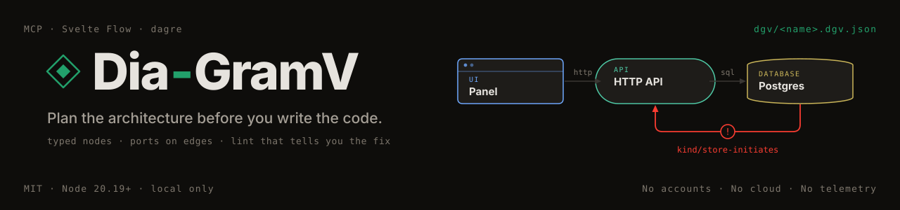

  <p><strong>A typed, linted model of the system you are building — one file your coding agent reads and writes through MCP, and you edit on a canvas.</strong></p>

  <p>
    
    
    
    
    
  </p>

  <p>Works with any MCP client. The skill and hooks are for Claude Code.<br/>Diagrams are JSON files in your repo. Runs on your machine — no accounts, no cloud, no telemetry.</p>

  <p>
    <a href="#thirty-seconds"><strong>30 seconds ↓</strong></a> ·
    <a href="#why-it-matters-when-an-ai-writes-the-code"><strong>Why</strong></a> ·
    <a href="#what-it-does--four-cases"><strong>Four cases</strong></a> ·
    <a href="#the-viewer"><strong>Viewer</strong></a> ·
    <a href="#reference"><strong>Reference</strong></a>
  </p>
</div>

<div align="center">
  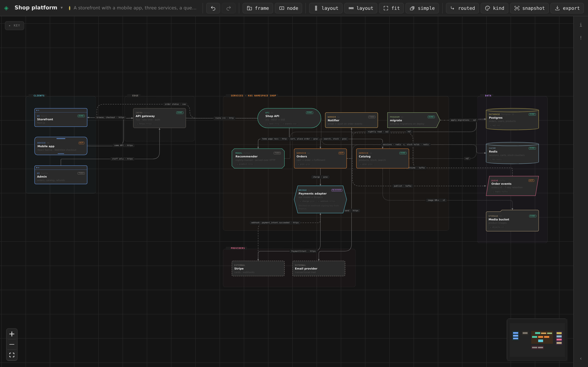
  <br/><sub><a href="examples/shop-platform.dgv.json"><code>examples/shop-platform.dgv.json</code></a> — 17 components, 21 connections, 7 kB · <a href="assets/shop-platform.svg">the same file as an SVG export</a></sub>
</div>

---

## Thirty seconds

```bash
git clone https://github.com/ShAInyXYZ/Dia-GramV.git && cd Dia-GramV
npm install && npm run build
node packages/mcp/bin/dgv.mjs doctor                        # checks Node + the build, prints the lines below with your path
claude mcp add dgv -s user -- node "$PWD/packages/mcp/bin/dgv.mjs" mcp
ln -s "$PWD/skill" ~/.claude/skills/dgv                     # optional: teaches the agent the workflow
```

Then, in any project, tell the agent:

> *Map this system in DGV before we start.*

It reads the catalog, writes `dgv/<name>.dgv.json`, gets a lint report back on every write, repairs what it broke, lays the diagram out and opens it at http://127.0.0.1:7710. From then on the file is the map: every later session reads it before it reads code.

Needs Node 20.19+ or 22.12+. `npm install` fetches everything (~100 MB, nothing global); `npm run build` compiles the viewer once. Skip the build if you only want the MCP tools — everything works without it except `dgv_open`.

## What it is

**One file.** `dgv/<name>.dgv.json` holds frames (boundaries), nodes (components) and edges (connections). Every node has a **kind** from a fixed catalog — `ui`, `service`, `api`, `db`, `queue`, `bridge`, `external`… — and can declare **ports**. Every edge names the port it lands on and the **protocol** it speaks. Plain JSON, in your repository, next to the code it describes.

**Two ways in.** The **MCP server** is the agent's: it creates, changes and reads the file, and on every write gets a lint report — a stable code, the element, and concrete fixes. The **viewer** is yours: a Svelte Flow canvas where kinds have shapes and wires carry their protocol, with an inspector for every field and the same lint live in a side panel. When the agent changes the file, the page reloads.

<div align="center">
  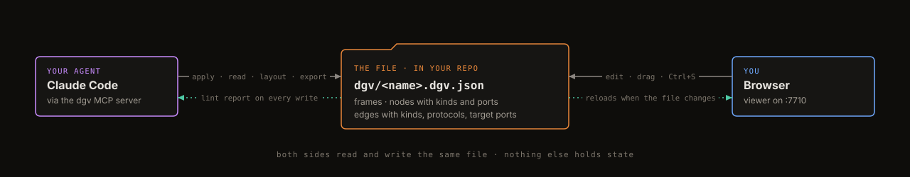
</div>

## Why it matters when an AI writes the code

The drawing is the least important part. What matters is that the model of the system is a file a program can read, check and change.

**If you vibecode**, the system grows faster than you can keep it in your head, and the shape you *think* it has drifts from the shape it has. DGV gives that shape a place to live, and a linter that objects when it stops making sense.

**If you develop with an AI beside you**, the diagram is where you state intent the code cannot express yet — *the worker consumes the queue; the API never writes to the bucket directly* — once, in a form every later session inherits.

**If you are the agent**, this is the difference between grepping and knowing. In an unfamiliar repository you rebuild the picture by opening files. `dgv_read` hands you the picture. Its complete output for the notes app below, verbatim:

```
# Notes app
frames 3 · nodes 6 · edges 5 · updated 2026-08-27

## frame browser: Browser
- web [ui] Notes UI — SvelteKit
## frame server: Server · one process
- api [api] HTTP API — /api/notes ports: rest:http/in
- jobs [worker] Job runner — thumbnails, exports
## frame data: Data
- pg [db] Postgres — notes, users ports: sql:sql/in
- redis [queue] Job queue — Redis lists ports: jobs:redis/in
- s3 [storage] Object store — uploads ports: put:s3/in

## edges
- web-api: web → api [sync http] fetch ports ·→rest
- api-pg: api → pg [data sql] ports ·→sql
- api-redis: api → redis [async redis] enqueue ports ·→jobs
- jobs-redis: jobs → redis [async redis] consume ports ·→jobs
- jobs-s3: jobs → s3 [data s3] ports ·→put
```

An agent that can read `api → pg [data sql] ·→sql` does not invent a REST endpoint on the database. Two hundred tokens replace a tour of the tree.

## What it does — four cases

### 1 · Plan before you build, and be told when the plan cannot work

The agent describes a small notes app in one `dgv_apply`. Two ordinary mistakes are in it: the object store's port is called `put` on the node and `upload` on the edge, and a database is calling back into the API.

```jsonc
dgv_apply({ name: "notes-app",
  nodes: [ { id: "s3", kind: "storage", label: "Object store", frame: "data",
             ports: [ { id: "put", protocol: "s3", dir: "in" } ] }, … ],
  edges: [ { id: "jobs-s3", source: "jobs", target: "s3", kind: "data", protocol: "s3", targetPort: "upload" },
           { id: "pg-api",  source: "pg",   target: "api", kind: "sync", protocol: "http", label: "notify on change" }, … ] })
```

The write goes through, and the report comes back in the same turn:

```jsonc
{ "ok": false, "lint": { "error": 1, "warning": 2, "info": 0 },
  "diagnostics": [
    { "code": "port/undeclared", "severity": "error",
      "message": "edge \"jobs-s3\" uses target port \"upload\" but node \"s3\" does not declare it",
      "subject": { "type": "edge", "id": "jobs-s3", "field": "targetPort" },
      "fixes": [ "add port {id:\"upload\"} to node \"s3\"", "point the edge at one of: put" ] },
    { "code": "kind/store-initiates", "severity": "warning",
      "message": "\"pg\" is a db; stores do not initiate sync calls to \"api\"",
      "subject": { "type": "edge", "id": "pg-api" },
      "fixes": [ "reverse the edge and mark it kind:\"data\"",
                 "if it is a trigger/CDC stream, add a worker or queue between them" ] }, … ] }
```

The same report in the viewer — the failing wire is red, and every entry jumps to its element:

<div align="center">
  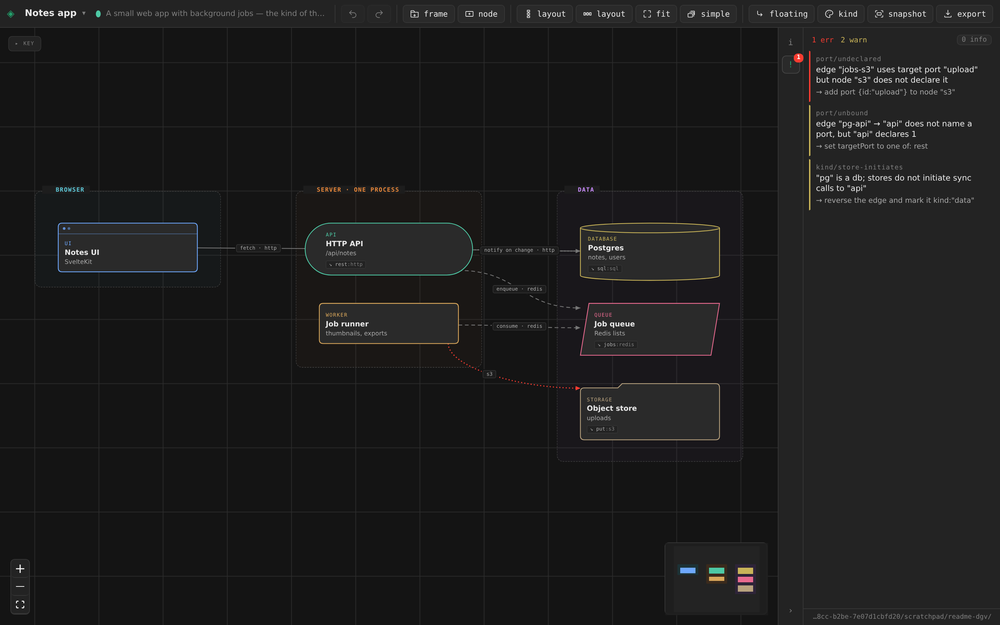
</div>

The first mistake is a typo that would have become a bug. The second is an architecture an agent would have implemented without a second thought. Both come back as an id, a code and a fix, so the plan is repaired before any code exists:

```jsonc
dgv_apply({ name: "notes-app",
            edges: [ { id: "jobs-s3", targetPort: "put" } ],       // partial: id + the field that changes
            remove: { edges: [ "pg-api" ] } })
→ { "ok": true, "lint": { "error": 0, "warning": 0, "info": 0 } }
```

<div align="center">
  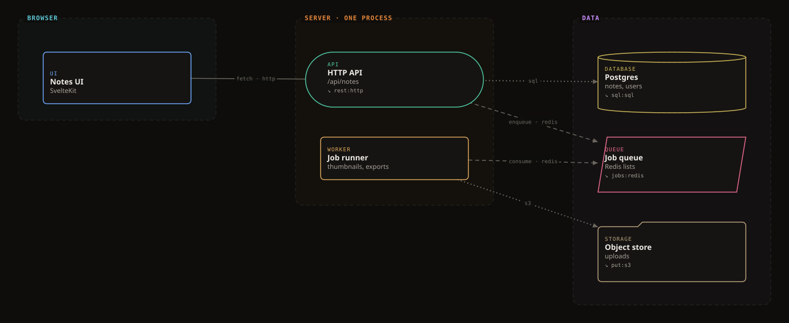
  <br/><sub>the repaired file, exported with <code>dgv_export format:"svg"</code> — <a href="examples/notes-app.dgv.json">source</a> · <a href="examples/notes-app-broken.dgv.json">the version with the two mistakes</a>, to see the lint yourself</sub>
</div>

### 2 · Map a system you already have

Point the agent at a repository — *map Cerveau's architecture in DGV, from the code* — and it reads entrypoints, listeners, clients and config, then writes what it found. The local AI harness below is 13 components in four boundaries: a panel and a phone driving a Go core, a llama.cpp server, Typesense for memory, a Python embedding sidecar.

<div align="center">
  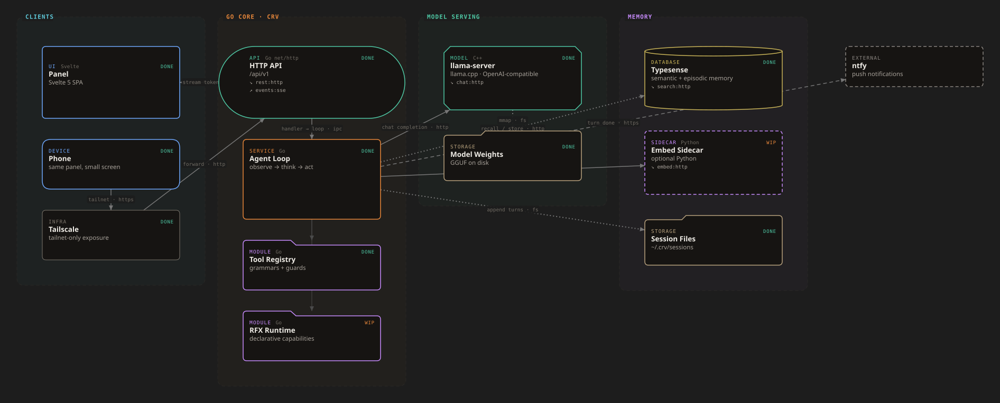
  <br/><sub><a href="examples/local-ai-harness.dgv.json"><code>examples/local-ai-harness.dgv.json</code></a></sub>
</div>

At full size — Cerveau itself, 35 components across 7 boundaries, every call bound to a declared port:

<div align="center">
  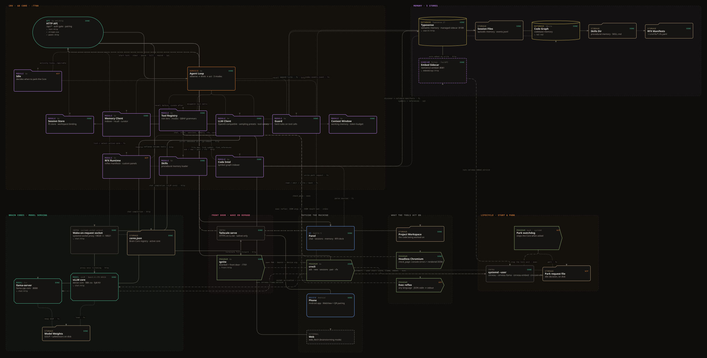
</div>

Press `S` and every frame folds into one node, with the wires that crossed it merged into a single labelled link. Same file; there is no second overview diagram to keep in step with the first:

<div align="center">
  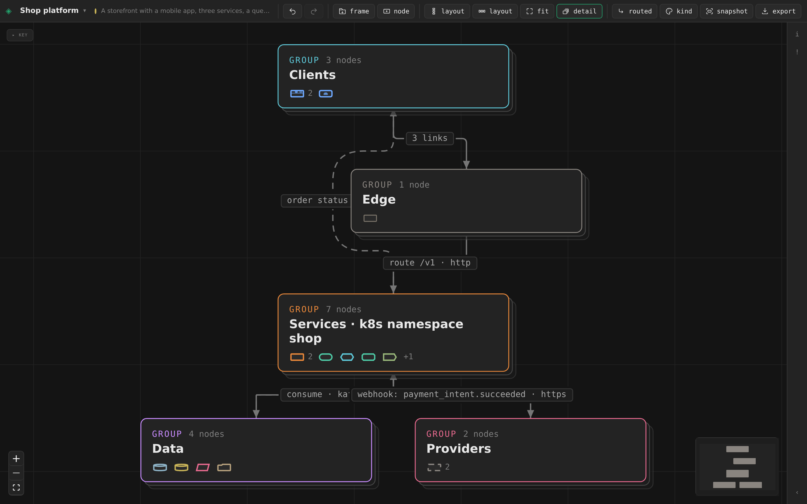
</div>

### 3 · Track the build on the same diagram

A node can carry a `status` — `todo` `wip` `done` `blocked` `failed` `update`. Press `2` and the canvas colours by status instead of kind; the file is now the build board. An agent picks up where the last session stopped by reading what is still `todo`, and a `note` on a blocked node says why:

<div align="center">
  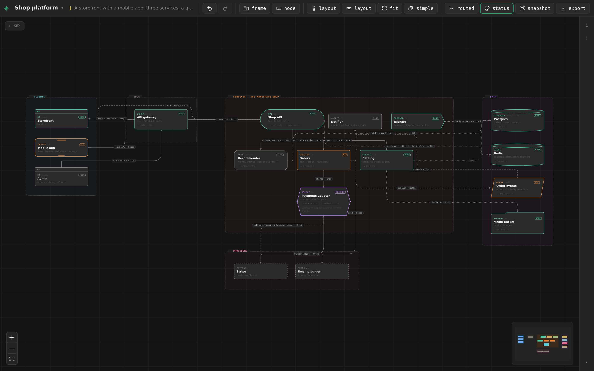
</div>

### 4 · Know when it stops being true

Lint says the plan is coherent. It cannot say the plan is *true* — that the code on disk is still the code the diagram describes. Give a node a `path` (a file, a directory, a glob, a list) and `dgv_drift` walks the project — `git ls-files`, so `.gitignore` is respected — and reports a `path` that matches nothing (`drift/missing`), a directory of code that belongs to no node (`drift/unclaimed`), and two nodes claiming the same file (`drift/shared`).

This repository keeps its own architecture that way, every node with a `path`:

<div align="center">
  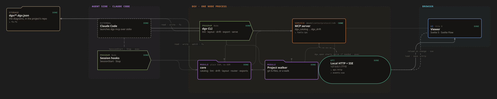
</div>

The first time drift ran on it, it found something:

```
$ node packages/mcp/bin/dgv.mjs drift dia-gramv
warning drift/unclaimed  packages/mcp/ — 1 of 5 files belong to no node
        fix: add a node with this path | widen an existing node's path to cover it | add it to meta.driftIgnore if it is not part of the system
```

`packages/mcp/package.json`, claimed by nobody, because the MCP node's `path` was one file. Widened, and clean.

Two optional Claude Code hooks close the loop ([`hooks/`](hooks/README.md); `doctor` prints the settings block with your path):

- **SessionStart** prints the outline of every diagram in `./dgv` into context, with its drift summary — the first thing the agent knows is the shape of the system and whether the map is stale.
- **Stop** runs drift after each turn and, only when there is something to say, leaves one line: `DGV · app: 1 node path no longer exists (old)`. It never blocks.

## The viewer

`node packages/mcp/bin/dgv.mjs serve` → http://127.0.0.1:7710 — or `dgv_open` from the agent.

<table>
<tr>
<td width="33%" valign="top">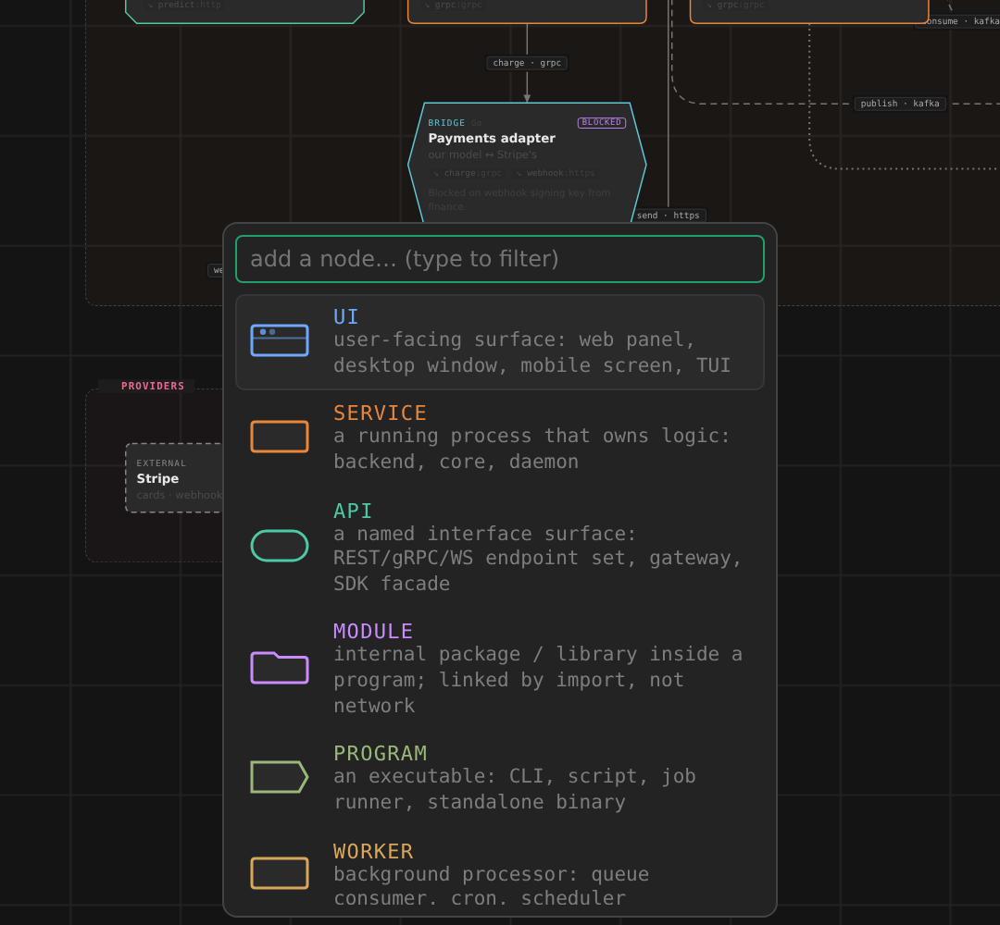<br/><sub><b>Add where you point.</b> Double-click the canvas or press <code>A</code>: pick a kind, it lands under the cursor, inside whatever frame is there.</sub></td>
<td width="33%" valign="top">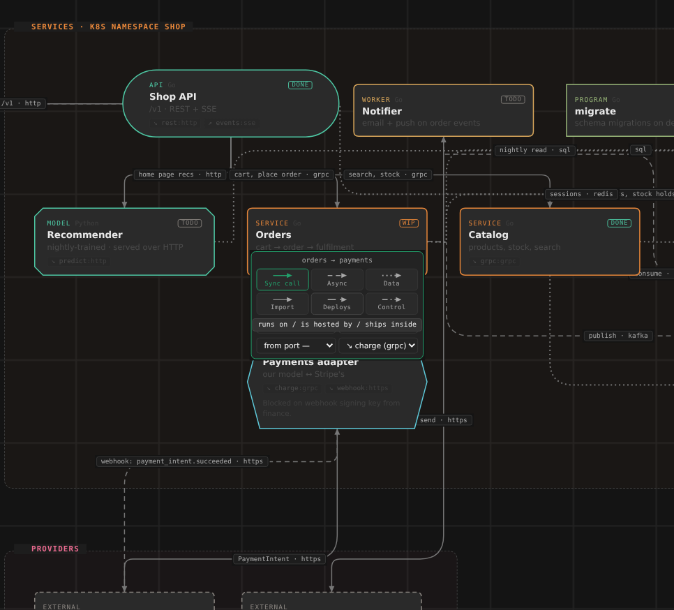<br/><sub><b>The wire is the contract.</b> Click one: kind, protocol, what happens, which port. Drag a new wire onto a port chip and it binds to that port.</sub></td>
<td width="33%" valign="top">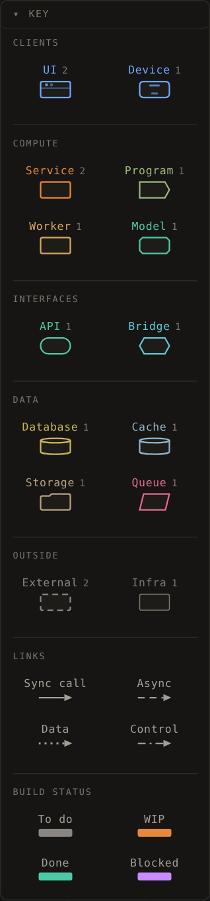<br/><sub><b>A key that filters.</b> Hover an entry to spotlight that kind on the canvas; click to pin it.</sub></td>
</tr>
</table>

Drag a node into a frame and it joins it; frames grow to fit. `Ctrl+Z` undoes. `Ctrl+S` saves — and if the agent changed the file while you had unsaved edits, the page says so and lets you choose. `L` cycles the wire style: floating bezier, routed around cards, straight. `Shift+S` saves what is on screen as a self-contained SVG, which is how every diagram in this README was made.

<details>
<summary>Every shortcut</summary>

| | |
|---|---|
| `A` / double-click | add a node, choosing its kind |
| drag from a node's right handle | connect; drop on a port chip to bind the edge to that port |
| `G` | wrap the selection in a new frame |
| `1` / `2` | colour by kind / by status |
| `L` | wire style: floating, routed, straight |
| `S` | fold every frame into one node; again to unfold. Hover a single frame to fold just that one |
| `Shift+S` | save what is on screen as SVG |
| `F` fit · `I` inspector · `P` problems · `Esc` close · `Del` delete · `Ctrl+S` save · `Ctrl+Z` undo |

The folded view keeps its own arrangement per diagram in your browser, never in the file.
</details>

## Reference

<details>
<summary><b>MCP tools</b></summary>

| tool | does |
|---|---|
| `dgv_catalog` | the node kinds (shape and meaning), edge kinds, protocols and statuses — read once per session |
| `dgv_list` | the diagrams in the directory, with counts |
| `dgv_read` | one diagram: `mode: "summary"` (the outline above, default) or `mode: "json"` |
| `dgv_create` | a new, empty diagram |
| `dgv_apply` | upsert frames, nodes and edges by id; remove by id; places new nodes; **returns the lint report**. Partial: to change one field on an existing element, send its id and that field |
| `dgv_lint` | the diagnostics: `code`, `severity`, `subject`, `fixes` |
| `dgv_drift` | does the diagram still describe the code? every `path` must exist, every directory of code must belong to a node |
| `dgv_layout` | dagre layout, `TB` or `LR`; overwrites positions |
| `dgv_open` | starts the viewer if it is not running and opens the diagram |
| `dgv_export` | `markdown` (tables), `mermaid`, `summary` (the outline), or `svg` |

Diagrams go to `./dgv` under the directory the agent was started in; `DGV_DIR` puts them elsewhere.
</details>

<details>
<summary><b>What the linter checks</b></summary>

Shape first (`schema/invalid`), then references (`ref/missing-node`, `ref/missing-frame`, `ref/duplicate-id`), then the rules below. Errors block `ok`; warnings and info are advice.

**Errors** — fix before moving on.

| code | fires when |
|---|---|
| `port/undeclared` | an edge names a port the node does not declare |
| `port/protocol-mismatch` | the edge's protocol is not the port's protocol |
| `port/direction` | an edge enters an `out` port, or leaves an `in` port |
| `graph/import-cycle` | modules import each other in a loop |
| `frame/nested` | a frame has a `parent` — frames do not nest; one level keeps folding, layout and the file simple |

**Warnings** — the plan probably has a hole.

| code | fires when |
|---|---|
| `port/unbound` | the target declares ports and a call edge names none |
| `contract/unspecified` | an edge between different kinds has neither a protocol nor a label |
| `kind/store-initiates` | a database, cache or bucket is the *source* of a call |
| `kind/import-across-programs` | an import crosses a frame boundary — two processes cannot share one |
| `kind/api-unused` | an API that nothing calls |
| `kind/bridge-one-sided` | a bridge touching fewer than two other nodes |
| `graph/orphan` | a node with no edges |
| `layout/overlap`, `layout/outside-frame` | cards overlap, or sit outside their frame — `dgv_layout` fixes both |

**Info** — worth a look, silent in the counts: `kind/store-access`, `kind/module-loose`, `kind/external-inside`, `graph/shared-store`, `layout/unplaced`.

A warning that is intentional gets `ack: "<reason>"` on its element: it becomes info with the reason attached, and the reason travels with the file. Errors cannot be acknowledged.
</details>

<details>
<summary><b>The file format and the catalog</b></summary>

```jsonc
{ "dgv": 1,
  "meta":   { "title": "Notes app", "description": "…", "colorBy": "kind", "edgeStyle": "routed" },
  "frames": [ { "id": "server", "label": "Server · one process", "tone": "amber",
                "position": { "x": 480, "y": 60 }, "size": { "width": 380, "height": 300 } } ],
  "nodes":  [ { "id": "api", "kind": "api", "label": "HTTP API", "sublabel": "/api/notes",
                "frame": "server", "status": "done", "path": "src/api", "position": { "x": 520, "y": 120 },
                "ports": [ { "id": "rest", "protocol": "http", "dir": "in" } ] } ],
  "edges":  [ { "id": "web-api", "source": "web", "target": "api",
                "kind": "sync", "protocol": "http", "targetPort": "rest", "label": "fetch" } ] }
```

<div align="center">
  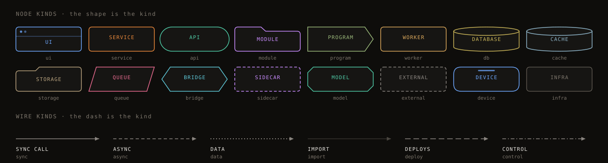
</div>

`kind` is required on a node. On an edge it is inferred from the protocol when omitted — `data` for `sql` `redis` `s3` `fs` `smb`, `async` for `kafka` `nats` `amqp` `mqtt` `sse` `ws`, otherwise `sync`. Positions are saved, so an arrangement you made stays made. The full catalog — every kind, protocol and lint code — is in [`skill/references/format.md`](skill/references/format.md).
</details>

<details>
<summary><b>CLI, for use without an agent</b></summary>

```bash
node packages/mcp/bin/dgv.mjs serve  [--dir d] [--port p] [--no-open]      # viewer, default http://127.0.0.1:7710
node packages/mcp/bin/dgv.mjs lint   <name|file> [--json]
node packages/mcp/bin/dgv.mjs layout <name|file> [--direction TB|LR]
node packages/mcp/bin/dgv.mjs export <name|file> [--format markdown|mermaid|summary|svg]
node packages/mcp/bin/dgv.mjs drift  <name|file> [--root dir] [--json]
node packages/mcp/bin/dgv.mjs list | catalog | doctor | open <name>
```
</details>

<details>
<summary><b>Packages</b></summary>

| path | what |
|---|---|
| `packages/core` | plain ESM, no DOM: catalog, schema, lint, dagre layout, orthogonal wire router, fold, exports, drift, file store |
| `packages/mcp` | the `dgv` CLI, the MCP server, and the local HTTP/SSE server behind the viewer |
| `packages/viewer` | Svelte 5 + Svelte Flow: shaped nodes, frames, folding, inspector, live problems |
| `skill/` | a Claude Code skill (`SKILL.md`) that teaches the workflow |
| `hooks/` | SessionStart and Stop hooks for Claude Code |
| `dgv/` | this repository's own diagram, drift-checked |
| `examples/` | [`notes-app`](examples/notes-app.dgv.json) · [`notes-app-broken`](examples/notes-app-broken.dgv.json) · [`shop-platform`](examples/shop-platform.dgv.json) · [`local-ai-harness`](examples/local-ai-harness.dgv.json) |

`npm test` — core: schema, lint rules, patch semantics, layout containment, folding, exports, SVG, drift.
</details>

## Limits

DGV does not parse your source. Lint can tell you the plan is coherent; drift can tell you every node still points at code that exists and every directory of code has a node. Neither can tell you that the *calls* the diagram draws are the calls the code makes — that is still read by a person, or by the agent, and the file living in the repo is what makes that reading reviewable.

Not here: collaboration or hosting, sequence and lifecycle diagrams, discovery of a repository's structure. The format is versioned (`dgv: 1`) so those can be added without breaking existing files.

## Where it came from

[Cerveau](https://github.com/ShAInyXYZ/Cerveau) is a local-first agentic coding harness. Its docs folder held a private draft called `arch-viewer`: a Svelte Flow canvas reading a `Diagram.json` of its architecture — 99 nodes, 127 edges, nodes with a kind, edges with a label. Nothing but a browser could read it, so the agent doing the building never saw it. DGV keeps the canvas, the frames and the layout, and puts a contract underneath: a catalog, ports and protocols, declared membership, a linter, and an MCP so the agent reads and writes the same file. [archify](https://github.com/tt-a1i/archify) supplied the idea of a typed intermediate representation with repairable diagnostics.

MIT © Mounir Belahbib
